# Atividade 01

Criação do grupo de recursos, criação da máquina virtual com SQL Server e configuração da aplicação Genexus.

## Criação do grupo de recursos

Entrar no portal do Azure https://portal.azure.com, clicar no item **Grupo de recursos**.

O grupo de recursos é uma forma de organizar os itens do Azure dentro de um "grupo" para facilitar a identificação dos elementos e também facilita o gerenciamento dos custos.

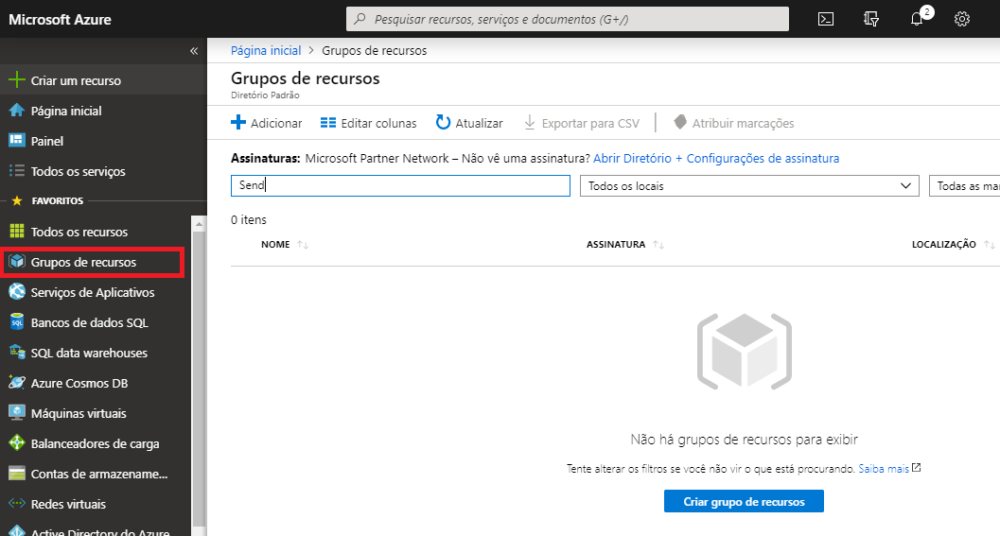

Clicar em **Adicionar**.

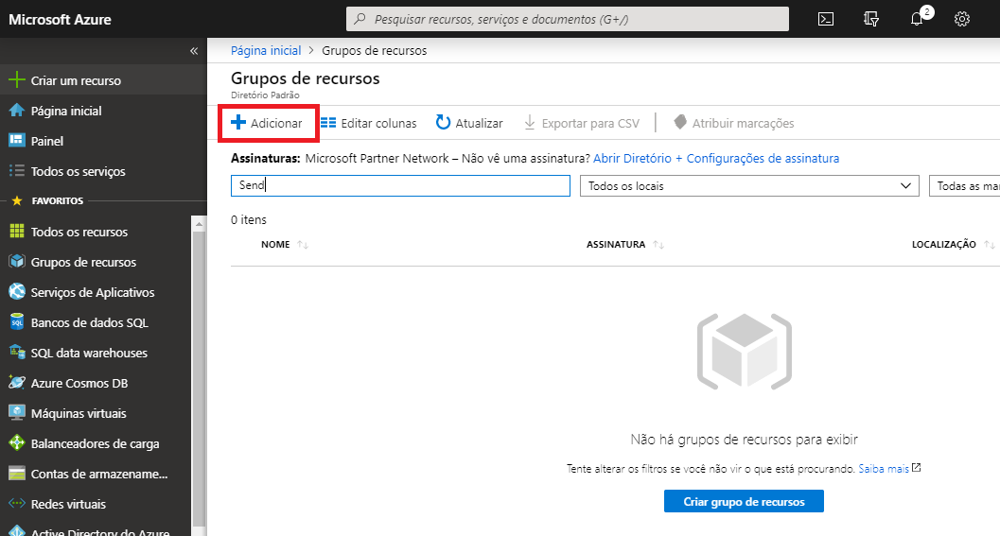

Preencher o campo **Grupo de recursos** com o texto "HandsOnDevOps" e clicar em **Revisar + criar**.

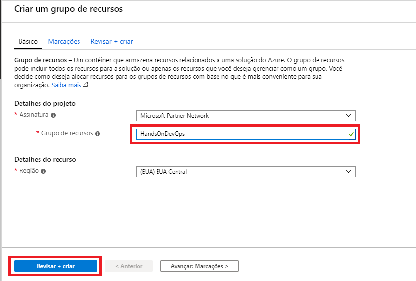

Preencher clicar em **Criar**.

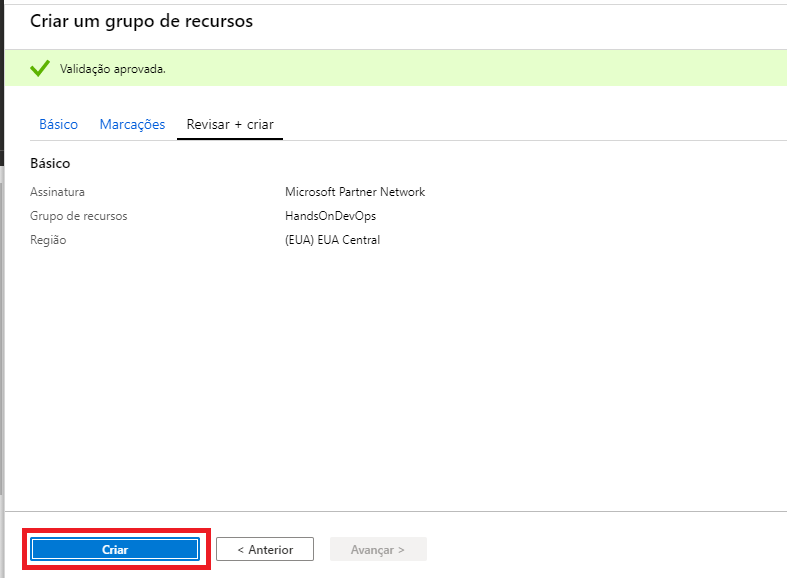

Após a criação do grupo, clicar em **Ir para o grupo de recursos**.

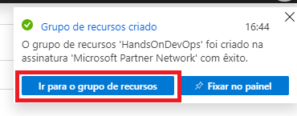

## Criação da Máquina Virtual

Na tela do grupo de recursos, clicar em **Adicionar**.

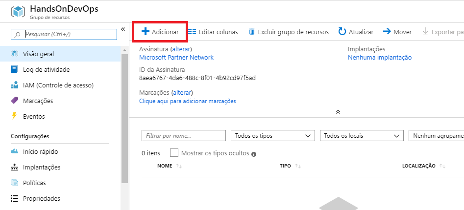

No campo de pesquisa digitar **Windows Server** e clicar no item **Windows Server**.

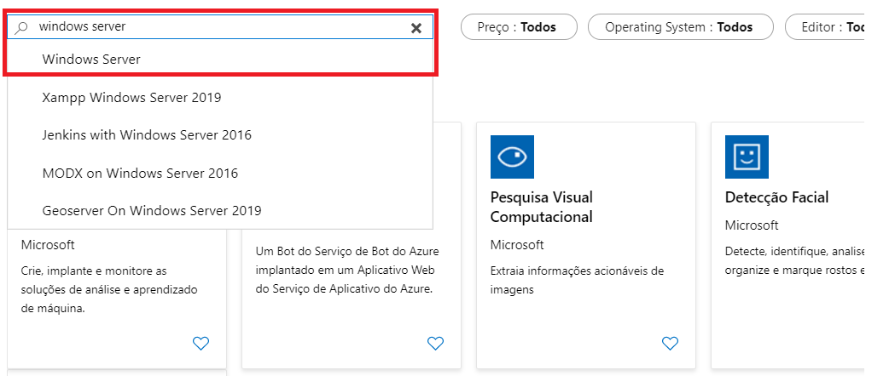

Selecionar o item **Windows Server 2012 Datacenter** e clicar em **Criar**.

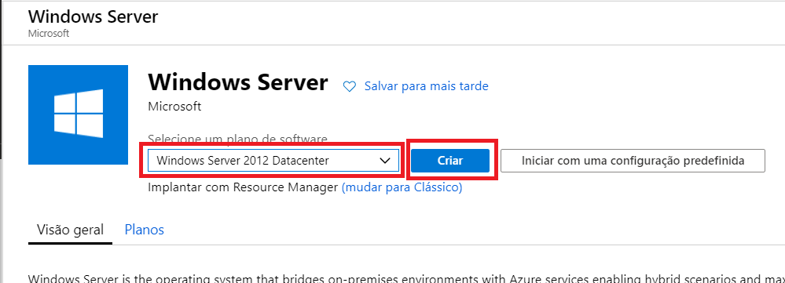

Preencher o campo **Nome da máquina virtual** com o texto **servidorweb**. E clicar em **Alterar tamanho** para selecionar o tamanho da VM.

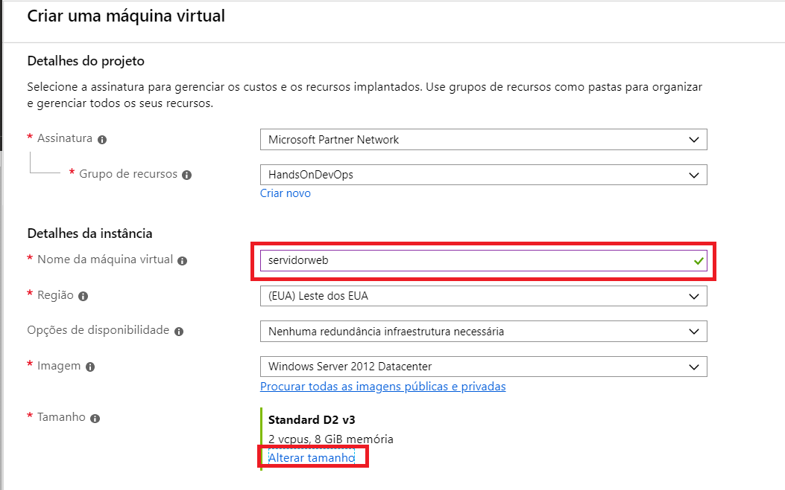

Selecionar o tamanho **D2_v3** que é uma VM com 2 cores e 8 GB de RAM. Clicar em **Selecionar** para confirmar a seleção.

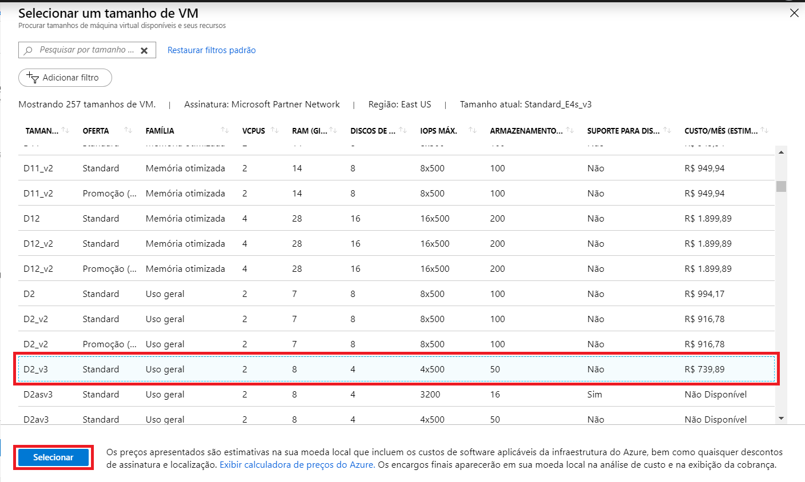

Preencher o campo **Nome de usuário** com o texto **adminweb** e o campo **Senha** com **Adminhandson2019**. 
Selecione o item **Permitir portas selecionadas** e no combo **Selecione as portas de entrada** selecione o item **RDP**. 
Clique em **Revisar + criar**.

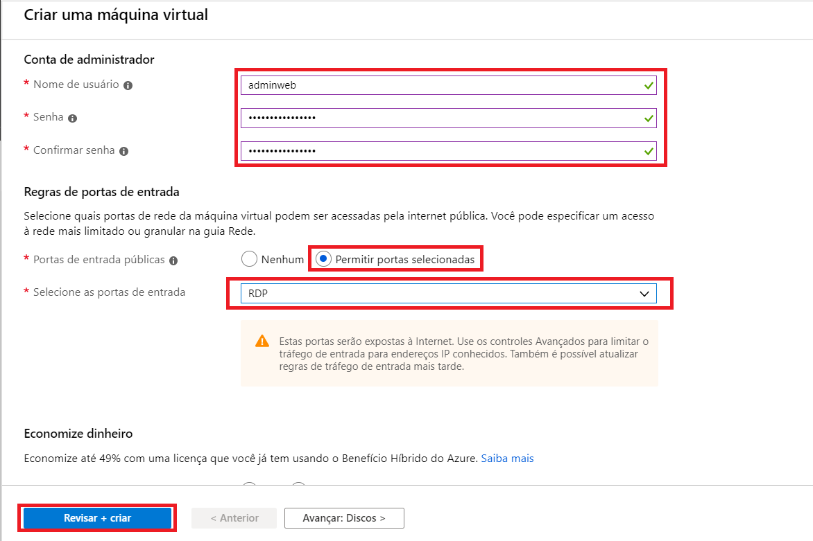

Confirmar a criação da VM clicando em **Criar**.

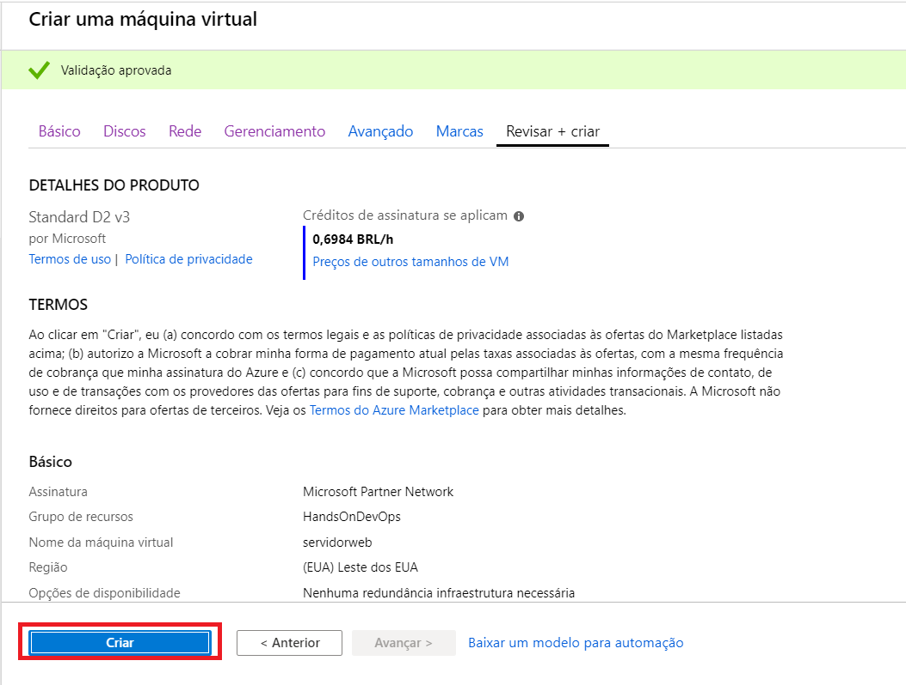

Após a conclusão da implantação da VM, clicar em **Ir para o recurso**.

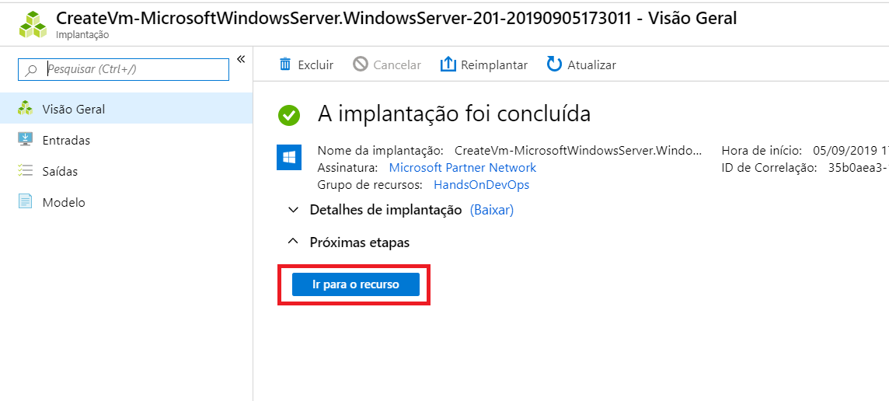

## Instalação do SQL Server Express e configuração do IIS

Na tela da máquina virtual, clicar na opção **Conectar**.

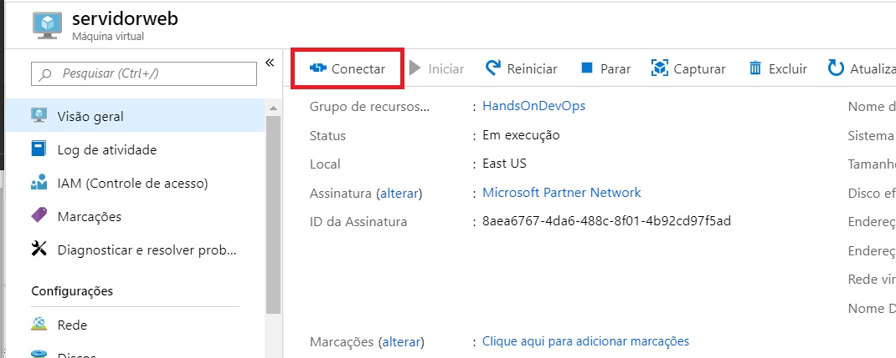

Clicar em **Baixar Arquivo RDP** para fazer o download do arquivo RDP para conectar a VM.

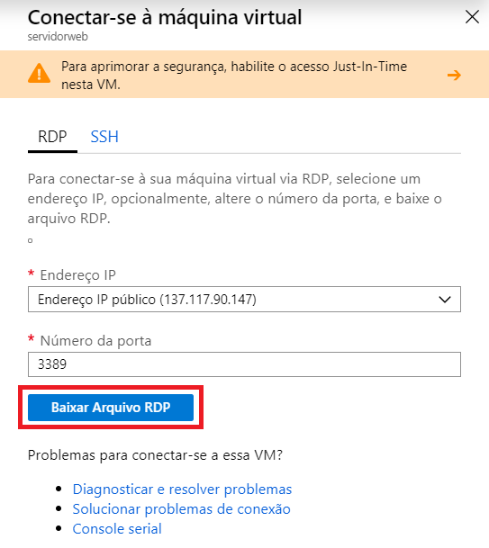

