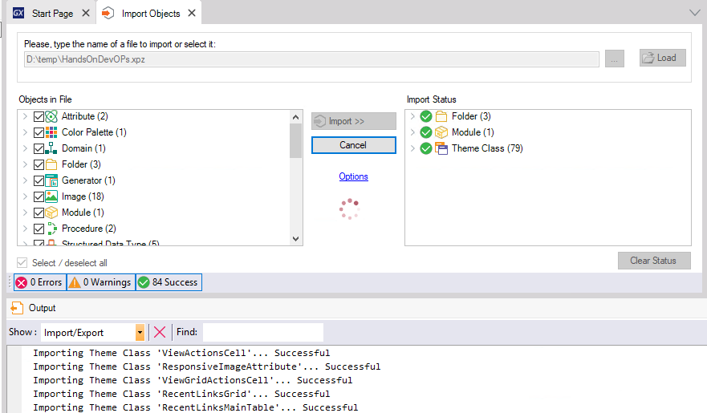
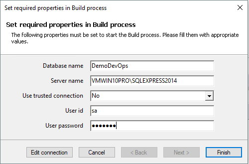
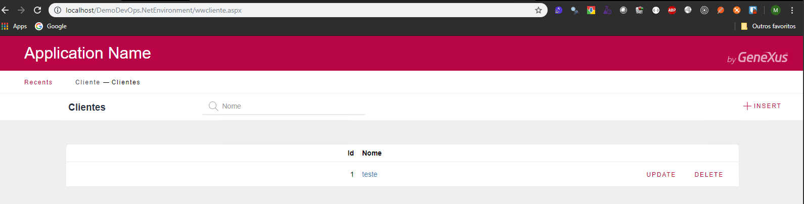
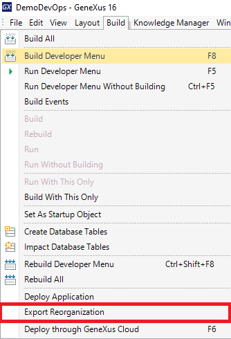
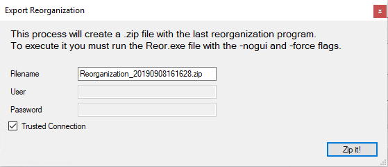
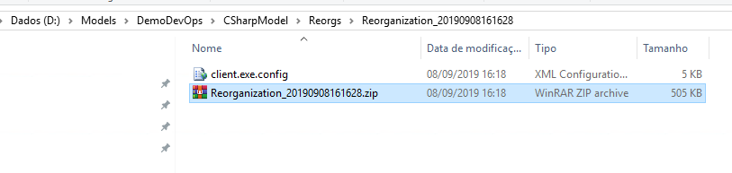
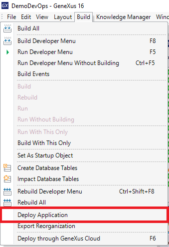

# Atividade 02

Nesta atividade vamos criar uma KB Genexus e instalar a aplicação gerada na VM no Azure.

## Criação da KB Genexus

Crie o uma KB com o Genexus 16 e importe o xpz abaixo:

- [xpz demo devops](arquivos/HandsOnDevOPs.xpz)

Após a importação dar um build All e criar a base de dados com o nome de **DemoDevOps**.

Executar a aplicação para verificar se a aplicação foi gerada de modo correto.

Agora vamos criar os pacotes de deploy, no menu Build do Genexus, clicar na opção **Export Reoganization**.

Marcar a opção Trusted Connection e clicar em **Zip It!**.

Será gerado o um zip com os programas de reorganização.

Agora vamos gerar o pacote de deploy da aplicação ASP.NET, no menu Build do Genexus, clicar na opção **Deploy Application**.

