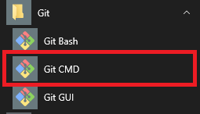
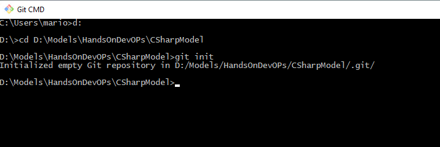
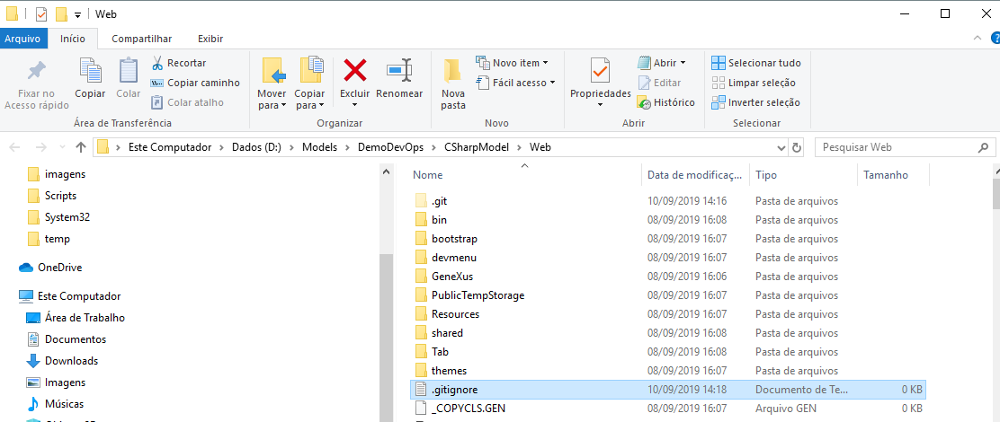
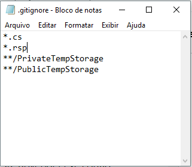
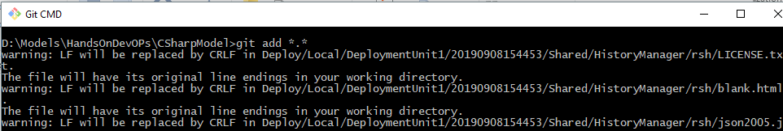

# Atividade 04

Nesta atividade vamos subir os programas Genexus para o Azure Repos usando o Git for Windows.

### Instalação do Git for Windows

Usaremos o Git for Windows para interagirmos com o Azure Repos, acesse o link abaixo para realizar o download. 

- [Download do Git for Windows](https://git-scm.com/download/win)

Após a instalação do Git, vamos usá-lo para iniciar um repositório no diretório da KB Genexus. Para isso abra o Git CMD.



Vamos criar um novo repositório, para isso usando o Git CMD, ir até o diretório do environment .NET. Posicionado no diretório do environment .NET, vamos digitar o comando **git init** para inicializar o repositório Git.



Crie um arquivo chamado **.gitignore** no diretório web do environment .NET.



Digite o seguinte conteúdo: 

```bash
*.cs
*.rsp
**/PrivateTempStorage
**/PublicTempStorage
```



Essas linhas vão fazer com que os arquivos com extensão **cs** e **rsp**, e o conteúdo das pastas **PrivateTempStorage** e **PublicTempStorage** sejam ignoradas pelo Git e não sejam armazenadas.

- [Mais informações gitignore](https://git-scm.com/docs/gitignore)

Vamos adicionar os arquivos ao repositório usando o comando **git add *.*** .




Próxima atividade: [Atividade 04](atividades/04-atividade.md)