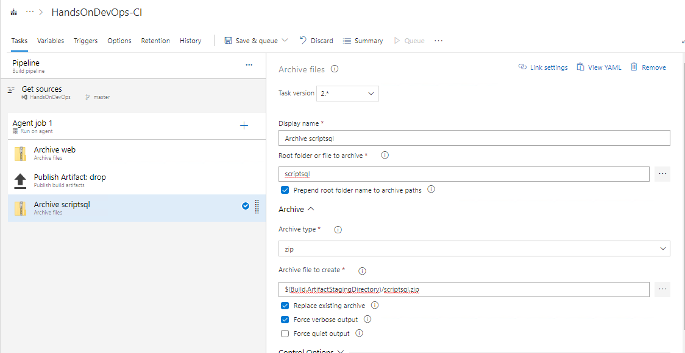
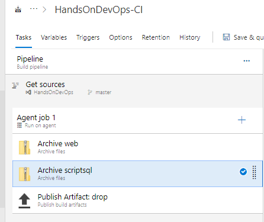
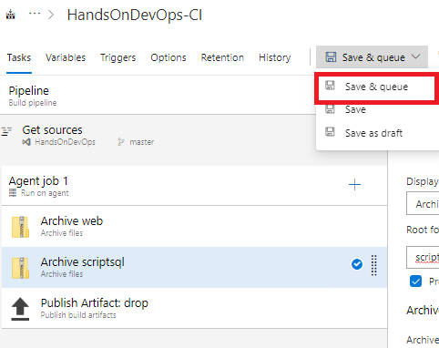
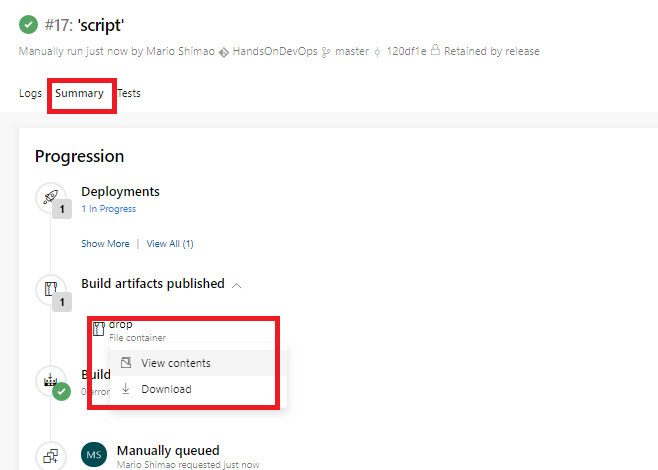
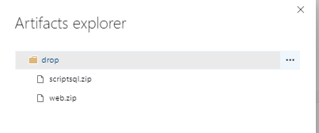
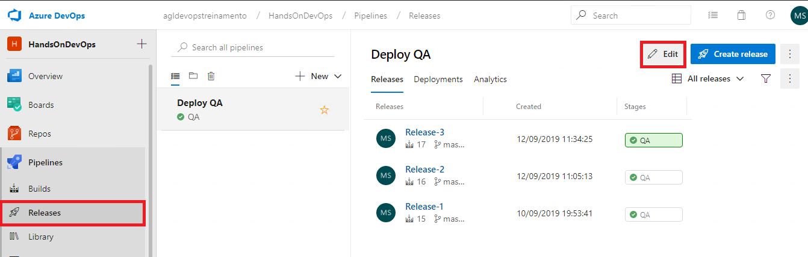

# Atividade 07

Nesta atividade iremos configurar os pipelines de build e de release para executar os scripts de reorganização do Genexus.

### Tabela de Controle

Para controlar a execução dos scripts sql iremos criar uma tabela de controle na base de dados da aplicação. Conecte na VM e abra o SQL Server Management Studio e execute o script abaixo para criar a tabela na base de dados.

```sql 
SET ANSI_NULLS ON
GO

SET QUOTED_IDENTIFIER ON
GO

SET ANSI_PADDING ON
GO

CREATE TABLE [dbo].[AzureDevOpsMigration]
(
                [Id] [int] IDENTITY(1,1) NOT NULL,
                [DataCriacao] [datetime] NOT NULL CONSTRAINT [DF_AzureDevOpsMigration_DataCriacao]  DEFAULT (getdate()),
                [DataExecucao] [datetime] NULL,
                [NomeArquivo] [varchar](100) NOT NULL,
                [ScriptSQL] [varchar](max) NOT NULL,
                CONSTRAINT [PK_AzureDevOpsMigration] PRIMARY KEY CLUSTERED 
(
                [Id] ASC
)WITH (PAD_INDEX = OFF, STATISTICS_NORECOMPUTE = OFF, IGNORE_DUP_KEY = OFF, ALLOW_ROW_LOCKS = ON, ALLOW_PAGE_LOCKS = ON) ON [PRIMARY]
) ON [PRIMARY] TEXTIMAGE_ON [PRIMARY]

GO

SET ANSI_PADDING OFF
GO

```


Criar uma pasta chamada **scriptsql** na pasta do environment do .NET. Nesta pasta iremos armazenar os scripts sql que serão executados pelo Azure Pipeline.


Agora vamos criar mais um atributo na transação cliente, para gerarmos uma reorganização no Genexus. Abra a transação Cliente, e crie um atributo chamado ClienteSobrenome Varchar(40), e salve a alteração.


Impactar as tabelas para gerar a reorganização.


Copiar as instruções SQL geradas e criar um arquivo chamado **addcoluna.sql**. Salvar esse arquivo na pasta **scriptsql**.


Abra o Git CMD e se posicione no diretório do environment .NET.


Vamos executar o comando commit para que os arquivos sejam armazenados no repositório.

```bash
git commit -a -m 'script'
```


Executar o comando push para subir os arquivos para o repositório do Azure Repos.

```bash
git push origin master
```


Acesse o Azure Repos para verificar se a pasta scriptsql e o arquivo addcoluna.sql está lá.


Agora vamos alterar o Pipeline de Build para pegar o arquivo sql e transformar num artefato para o Pipeline de Release.
Clique no item **Builds** para listar os pipelines. Clicar na opção **Edit** para abrir o pipeline para edição.


Clicar no **+** no item **Agent job 1**. Preencher o campo de pesquisa com **Archive** e selecinar o item **Archive files** e clique em **Add**.


Editar as propriedades.

| Campo | Valor | 
| --- | --- |
| Display name | Archive scriptsql |
| Root folder or file to archive | scriptsql |
| Archive file to create | $(Build.ArtifactStagingDirectory)/scriptsql.zip |

E setar o checkbox da propriedade **Force verbose output** para podermos visualizar a execução do comando.



Arrastar o item **Archive scriptsql** para cima do **Publish Artifact: drop**.



Vamos salvar o pipeline e executá-lo clicando em **Save & queue**.



Após o pipeline executar, clicar no item **Summary**, e no item **drop**, clicar no texto **...**, e depois em **View contents** para verificar se o artefato do script sql foi gerado.





Agora vamos editar o pipeline de release para executar o script SQL. Clicar em **Release** e na opção **Edit**.



Vamos editar o stage, e adicionar as tasks para executar o script SQL. Para isso, clicar no item **1 job, 2 tasks**. 


Clicar no **+**, digitar **extract** no campo de pesquisa e selecinar o item **Extract Files** e clicar em **Add**.

